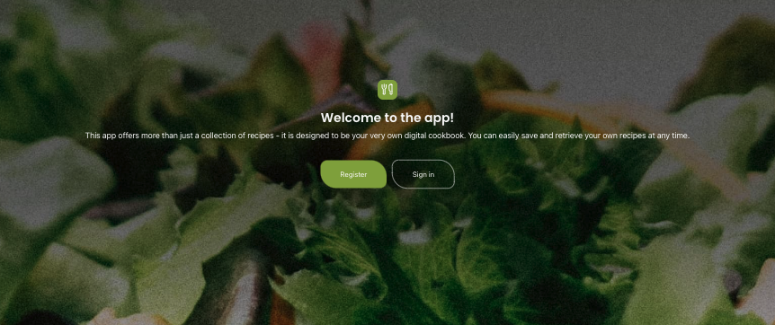
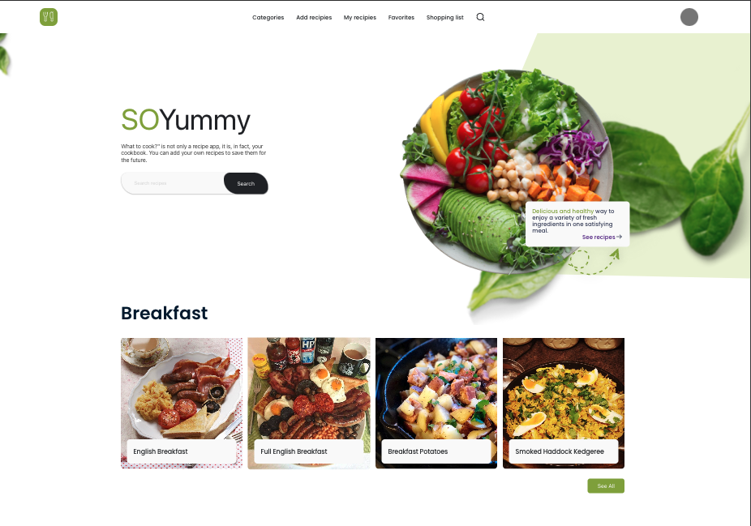

#  ✨SoYummy ✨

SoYummy is a web application designed to help users discover, save, and organize recipes. With SoYummy, you can explore various recipes, save your favorites, create your own recipes, manage your shopping list, and more.

## Installation
To run SoYummy locally on your machine, follow these steps:
- Clone this repository to your local machine.
- Navigate to the project directory in your terminal.
- Run npm install to install all dependencies.
- Run npm start to start the development server.
- Open your web browser and navigate to http://localhost:3000 to view the application.

🔨 Please note that upon launching the application, it may take a moment for the server to fetch data to populate the elements on the page. 🔨

## Features

- Authentication
SoYummy provides user authentication functionalities, including user registration and login. Users can create an account to access personalized features and save their preferences.

- Recipe Exploration
Explore a wide range of recipes from various categories. SoYummy offers a user-friendly interface to browse through recipes, view details, and get inspired to try new dishes.

- Recipe Management
Save your favorite recipes for quick access. With SoYummy, you can easily manage your collection of recipes, mark them as favorites, and organize them according to your preferences.

- Recipe Creation
Create and share your own recipes with the SoYummy community. Share your culinary creations, including ingredients, instructions, and images, to inspire others and showcase your cooking skills.

- Shopping List
Plan your grocery shopping efficiently with SoYummy's built-in shopping list feature. Add ingredients from recipes directly to your shopping list, making it easy to gather everything you need for your next culinary adventure.

- Error Handling
SoYummy includes error handling mechanisms to provide users with a seamless browsing experience. If a page or resource is not found, the application gracefully handles errors and guides users back on track.

## API Repository

The API for SoYummy is maintained in a separate repository. You can find it here [ --> SoYummy-api](https://github.com/RafalCeglinsk/SoYummy-api).

## Technologies Used

Dillinger uses a number of open source projects to work properly:

- [React.js] - A JavaScript library for building user interfaces.
- [React Router] - Declarative routing for React applications.
- [Redux] - State management library for JavaScript applications.
- [Node.js] -JavaScript runtime environment for server-side development.
- [Express.js] -Web application framework for Node.js.
- [MongoDB] - NoSQL database for storing application data.

## Contributors

- github: [Rafał Cegliński](https://www.github.com/RafalCeglinsk)
- github: [Krzysztof Kryczka](https://www.github.com/krzysztof-kryczka) 
- github: [Michał Stanaszek](https://www.github.com/MichalStanaszek)
- github: [Zuzanna Maciejczyk](https://www.github.com/Zjadlbyscos) 
- github: [Marta Kowalska](https://www.github.com/KowalskaMarta) 
- github: [Mikołaj Bajdalski](https://www.github.com/MikolajBajdalski) 
- github: [Michał Szmajduch](https://www.github.com/MichalSzmajduch) 
- github: [Piotr Dubiel](https://www.github.com/PiotrD1994) 
- github: [Stefan Bielak](https://www.github.com/StefanBielak) 
- github: [Kamil Kucharczyk](https://www.github.com/KamilKucharczyk) 